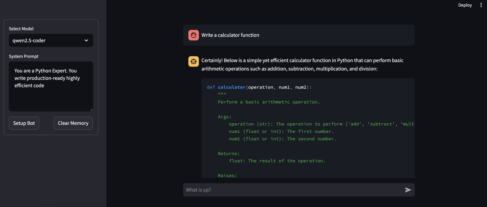

# LocalLLMChatbot



Welcome to the LocalLLMChatbot repository! This project allows you to run your own local Large Language Model (LLM) chatbot using an API like Ollama. Below, you'll find information on how to set up and use the application.

## Overview

The `LocalLLMChatbot` is designed to provide a simple interface for interacting with a locally hosted LLM through a web application built with Streamlit. It includes features such as selecting a model, setting a system prompt, generating chat responses, and clearing memory.

## Prerequisites

Before you start using the project, ensure that you have the following installed:

1. **Python**: Version 3.10 or higher.
2. **Ollama API**: Ensure the Ollama API is available and properly configured on your local machine. You can find instructions on how to set up Ollama API here: [Ollama API Documentation](https://ollama.com).
3. **UV**: An extremely fast Python package and project manager, written in Rust. You can find instructions on how to install UV here: [UV Documentation](https://github.com/astral-sh/uv).

## Installation

To get started, follow these steps:

1. Clone the repository to your local machine:
    ```sh
    git clone https://github.com/palash-jain-cw/LocalLLMChatbot.git
    ```

2. Navigate to the project directory:
    ```sh
    cd LocalLLMChatbot
    ```

3. Install the required Python packages:
    ```sh
    uv pip install -e .
    ```

## Running the Application

1. Run the Streamlit app using the following command:
    ```sh
    streamlit run src/localllmchatbot/Home.py
    ```
2. Open your web browser and navigate to `http://localhost:8501` to interact with the chatbot.

## Configuration

### Model Selection

In the sidebar, you can select the model you want to use for generating responses. The available models are fetched from the Ollama API on app startup. Refer to Ollama documentation to add more models as needed.

### System Prompt

You can set a system prompt that will guide the behavior of the LLM. This prompt is initially set and can be updated as needed.

### Clear Memory

Clicking the "Clear Memory" button resets the chat history, allowing you to start fresh.

## Usage

1. **Select Model**: Choose the desired model from the dropdown menu.
2. **Set System Prompt**: Enter a system prompt in the text area at the bottom of the sidebar.
3. **Setup Bot**: Click "Setup Bot" to initialize the chatbot with the selected settings.
4. **Start Chatting**: Use the chat input box below the sidebar to type your messages, and the assistant will respond based on the current model and system prompt.

## Logging

The application uses `loguru` for logging. Logs are written to a file (`logfile_{time:YYYY-MM-DD}.log`) within a logs directory in the root directory of the project and also printed to the console with detailed error backtraces.

## Customization

You can customize the application by modifying the code in the `Home.py`, `LocalModelChat.py`, and `logger_setup.py` files. The project is designed for easy extension and modification.

## Contributing

Contributions are welcome! If you find any issues or have suggestions, feel free to open an issue or submit a pull request.

---

Thank you for using LocalLLMChatbot! Enjoy building your custom chatbots with local LLMs.